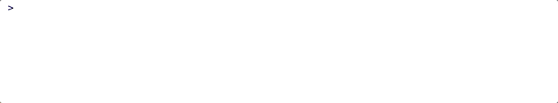

<!-- README.md is generated from README.Rmd. Please edit that file. -->

```{r setup, include = FALSE}
knitr::opts_chunk$set(
  echo      = FALSE,
  message   = FALSE,
  warning   = FALSE,
  out.width = "100%"
)
library(ghreadme)
# read in data 
stats <- readRDS("2026-06-03-stats.rds")
```

```{r who_am_i, eval = FALSE, echo = FALSE}
who_am_i(
  name   = "Martin",
  likes  = "#rstats and data visualization.",
  learn  = "Shiny for Python app development and Linux administration",
  work   = "Shiny app-package development tools.",
  collab = "#rstats and #pystats packages for data science."
)
```

{width='100%'}

## GitHub activity

{width='100%'}

{width='100%'}

{width='100%'}

```{r gh_badges, results = "asis"}
gh_badges(
  username = "mjfrigaard",
  badge    = c("details", "stats", "repo_lang"),
  theme    = "dark"
)
```


```{r so_rep, eval = FALSE, results = "asis"}
so_rep(
  username = "your-so-username",
  user_id  = "00000"
)
```
