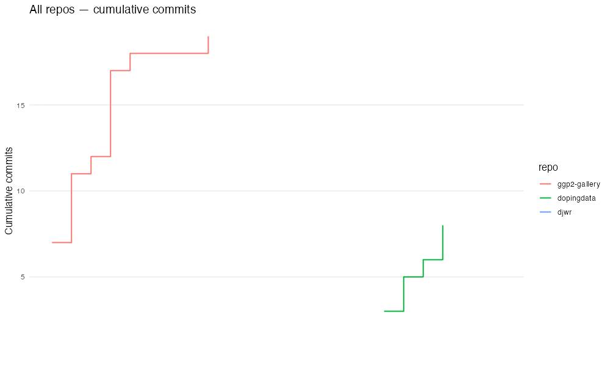

```{r setup, include=FALSE}
knitr::opts_chunk$set(
  echo = TRUE,
  comment = "\t",
  fig.path = "",
  out.width = "100%")
```

This `README.md` is updated using the [`ghreadme` package](https://mjfrigaard.github.io/ghreadme/index.html). 

```{r}
library(ghreadme)
```

Generate badge markdown for the `README.md` body:

```{r gh_badges, results='asis', echo=TRUE}
gh_badges(
  username = "mjfrigaard",
  badge    = c("details", "commit_lang", "stats"),
  theme    = "dark"
)
```


```{r who_am_i, echo=FALSE, eval=FALSE}
source("who_am_i.R")
```


## What I'm working on

{width=100%}


{width=100%}

{width=100%}


