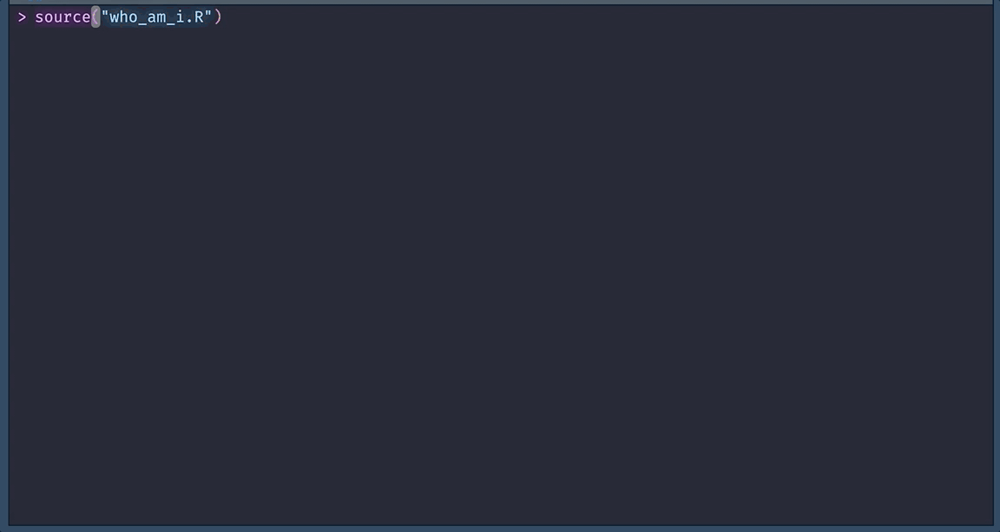

Hi there 👋
================
Martin Frigaard
updated: 2023-06-16

<!--
**mjfrigaard/mjfrigaard** is a ✨ _special_ ✨ repository because its `README.md` (this file) appears on your GitHub profile.
&#10;Here are some ideas to get you started:
&#10;- 🔭 I’m currently working on ...
- 🌱 I’m currently learning ...
- 👯 I’m looking to collaborate on ...
- 🤔 I’m looking for help with ...
- 💬 Ask me about ...
- 📫 How to reach me: ...
- 😄 Pronouns: ...
- ⚡ Fun fact: ...
-->
